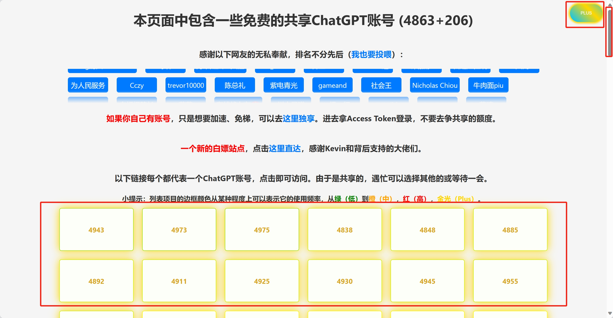

# Only Gpt Plus

Only Gpt Plus 是一个用户脚本，用于在 zhile 大佬的 [chat-shared](https://chat-shared3.zhile.io/shared.html) 页面上切换是否仅展示 "plus"。该脚本会隐藏所有不包含 "plus" 类的链接，并创建一个带有动画效果的按钮，用于切换 "非plus" 的可见性。

**仅展示金光闪闪的链接，可以让你更快地使用 plus。**

## 安装

1. 安装用户脚本管理器，如 Tampermonkey。
2. 复制该脚本。
3. 在 Tampermonkey 中添加新脚本中粘贴。

## 使用

在 zhile 大佬的 [chat-shared](https://chat-shared3.zhile.io/shared.html) 页面上，点击页面右上角的 "PLUS" 按钮，即可切换链接的可见性。

## 展示

## 其他

`chat-shared` 网站是 zhile 大佬免费提供的，如果你觉得这个网站对你有帮助，不妨考虑一下去 [pandora](https://github.com/zhile-io/pandora) 点个 star ，以及有关网站本身的相关问题，可以去 [pandora-issues](https://github.com/zhile-io/pandora/issues) 搜索 & 提问。

**参考**：
1. [关于白嫖和点赞](https://github.com/zhile-io/pandora/issues/307)
2. [关于网址变动和可用性](https://github.com/zhile-io/pandora/issues/206)

## License

该项目基于 GPLv2 许可证开源。